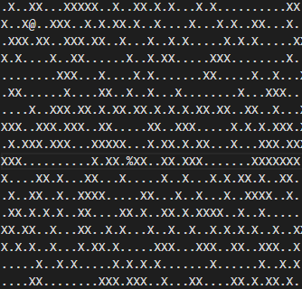
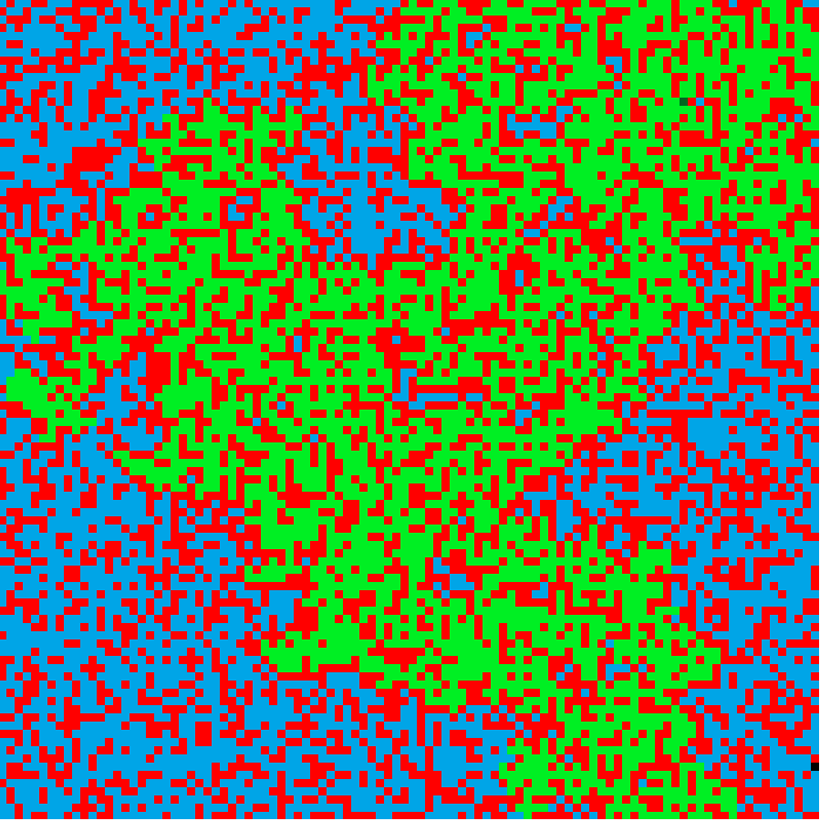
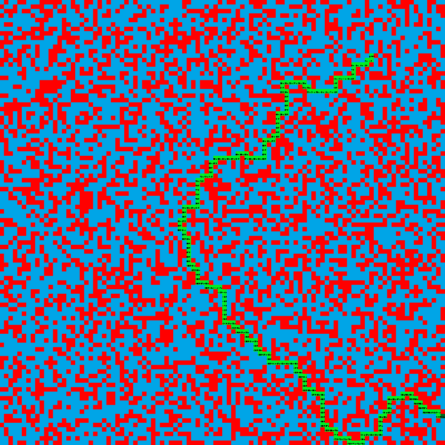

# A star algorithm + map generator
## Map  


|Block|Color in map|Character in file|
|:---:|:---:|:---:|
|Start / Found end||%
|Explored space||/
|End||@
|Free space||.
|Block||X

## Run program
1. ### Run with map parameter
    Find shortest path from "%" to "@" on a given map.  
    ```python find-point.py map-name.txt```

2. ### Run with no parameter
    Program will create randomly generated map and try to solve the map.  
    If the map isn't solvable, it generates new one and tryes again.  
    This continues until a randomly generated map is successfully solved.  
    ```python find-point.py```

|Proccess of finding a solution|Solution found|
|:--:|:--:|
|||
